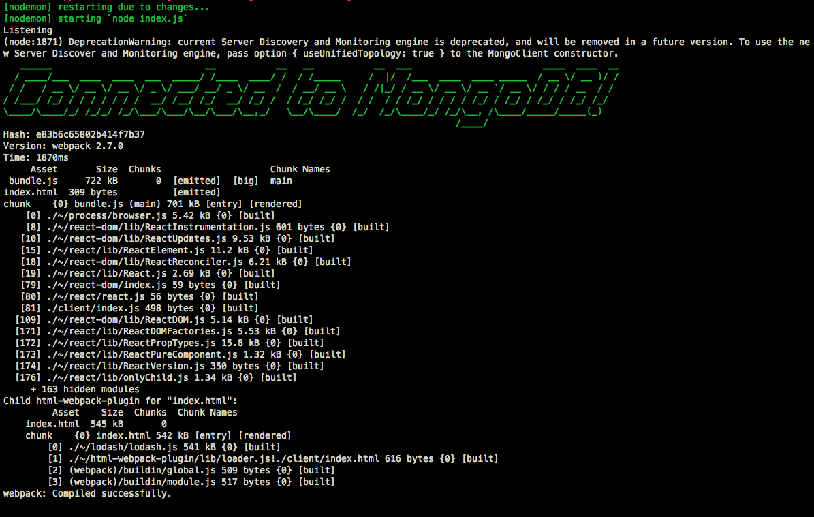

# GraphQL with React Notes

- [Udemy course by Stephen Grider](https://www.udemy.com/course/graphql-with-react-course/)

## Lyrical-GraphQL

### Updating the linked repo

The repo linked in this course has outdated elements and things that need fixing to be brought up to Feb 2020 spec.

These have been addressed to provide a starting point on my repo, **commit hash 9b30437.**

#### MongoURI & dbAuth.js

In Stephen's original repo, he hardcoded the MongoDB username and password into `MONGO_URI` in `server.js`.

Because I want to be able to add this project to my github, I've set up MongoDB auth using data we pull in from a file I made called `dbAuth.js`.

`dbAuth.js` is a file you need to create in this project's root folder. It isn't present after cloning the repo because it has been added to `.gitignore` since it contains personal auth data.

Create `dbAuth.js`, then replace `dbUsername` and `dbPassword` with the info obtained from following Section 6, #33 - *MongoDB Atlas Setup and Configuration*:

```js
module.exports = {
  dbUsername: "<dbUserName>",
  dbPass: "<dbPassword>"
};
```
If successfully, your terminal should resemble this:



